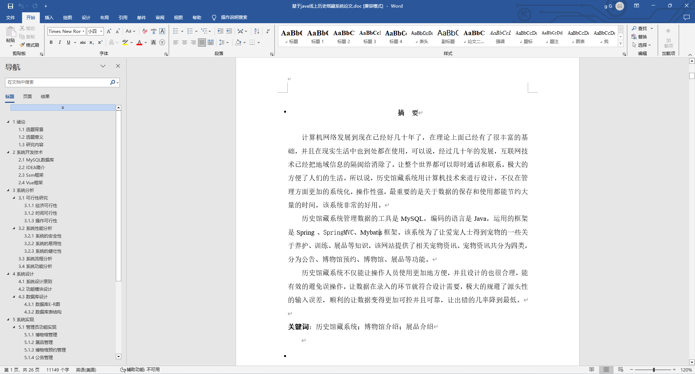
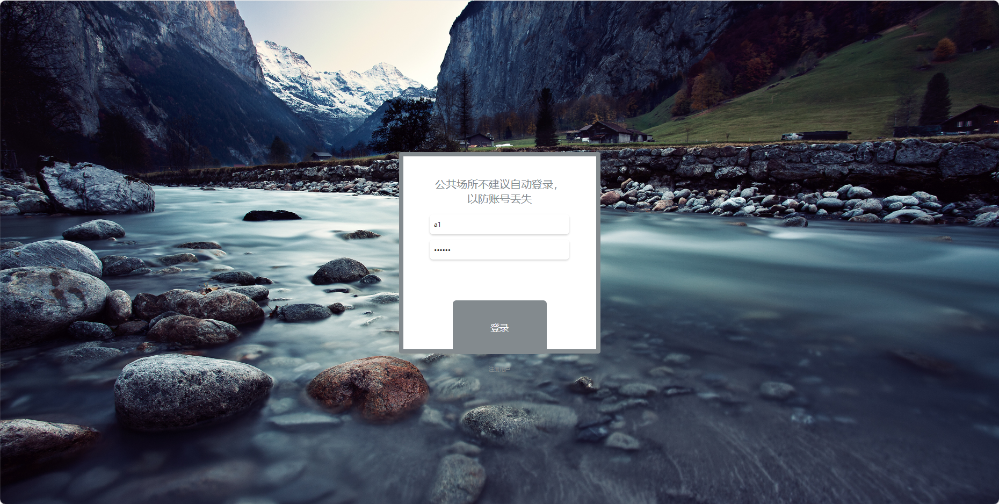
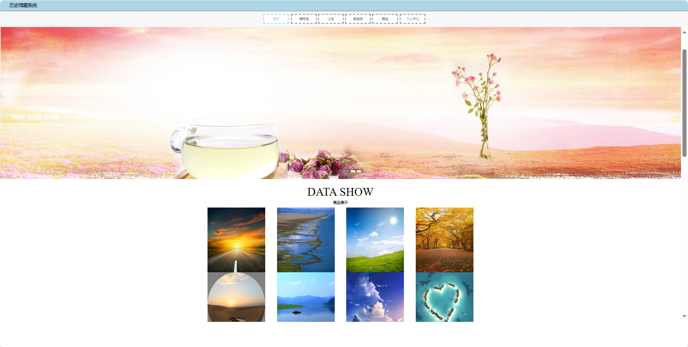
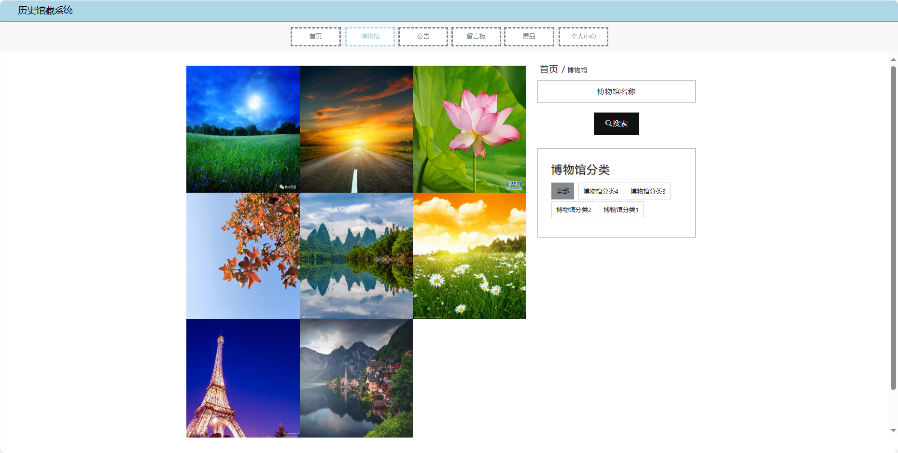
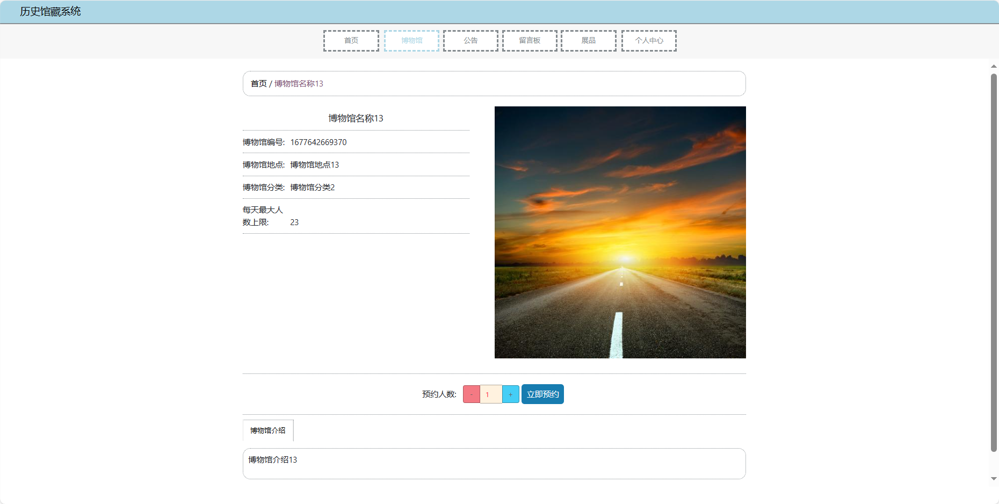
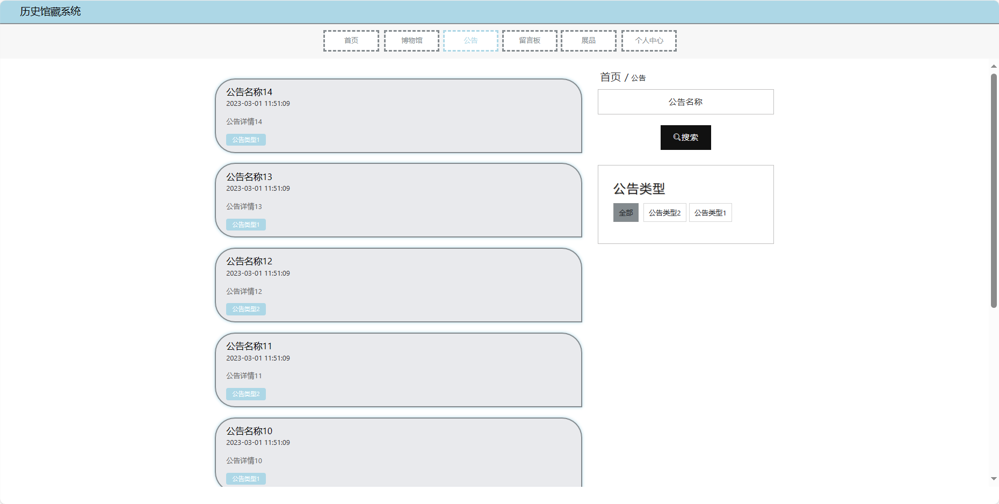
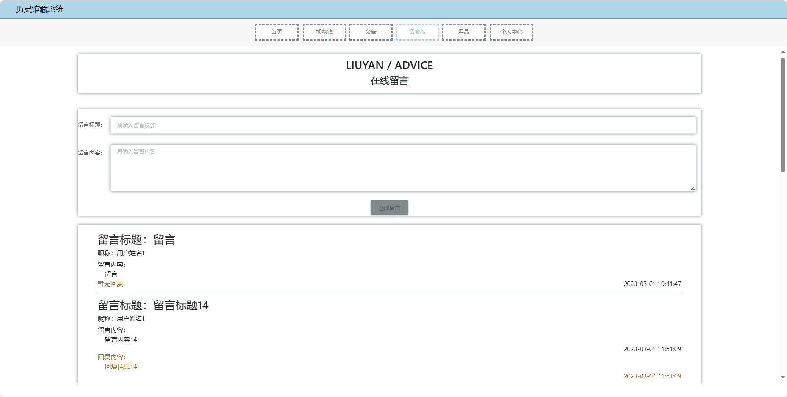
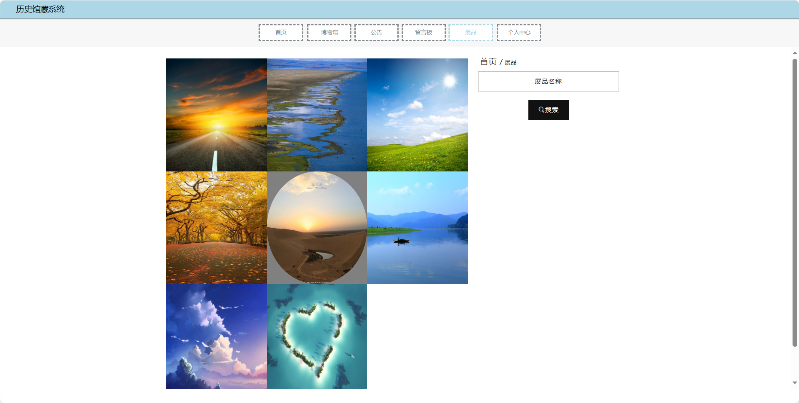
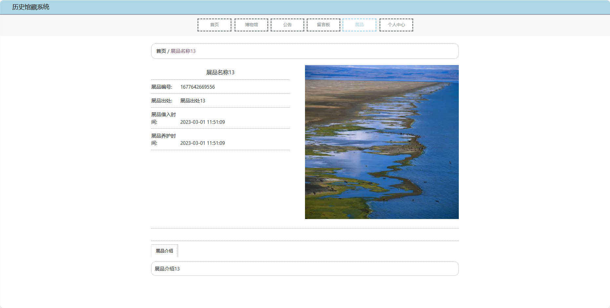
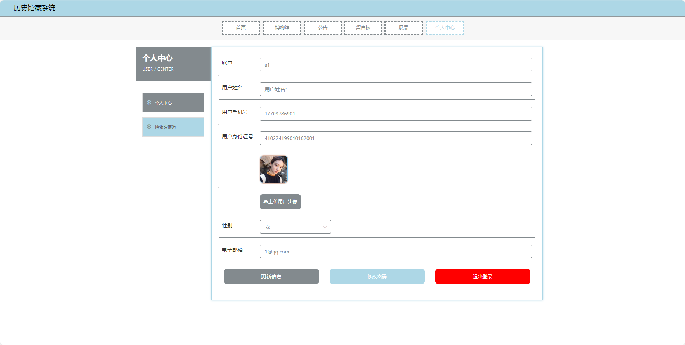

基于Springboot的历史馆藏系统（程序+论文）
=
### 完整代码获取地址：从戎源码网 ([https://armycodes.com/](https://armycodes.com/))
### 作者微信：19941326836  QQ：952045282 
### 承接计算机毕业设计、Java毕业设计、Python毕业设计、深度学习、机器学习
### 选题+开题报告+任务书+程序定制+安装调试+论文+答辩ppt 一条龙服务
### 所有选题地址https://github.com/nature924/allProject

一、项目介绍
---
基于Spring Boot框架实现的历史馆藏系统，系统包含两种角色：管理员、用户,系统分为前台和后台两大模块，主要功能如下。
### 【前台功能】

1. 首页：提供用户进入系统的入口。
2. 博物馆：用户可以了解博物馆的基本信息。
3. 公告：发布博物馆的最新通知、特别活动等信息。
4. 留言板：用户可以在留言板上留下对博物馆的留言、建议等。
5. 展品：展示博物馆的馆藏展品。
6. 个人中心：用户可以管理个人信息。

### 【后台功能】

1. 首页：提供管理员进入后台管理的入口。
2. 个人中心：管理员可以管理个人信息。
3. 管理员管理：添加、编辑、删除系统管理员账号。
4. 用户管理：查看、编辑、冻结或删除用户账号。
5. 基础数据管理：管理系统的基础数据。
6. 公告管理：发布、编辑、删除博物馆的通知和公告。
7. 留言板管理：查看、删除用户在留言板上的留言。
8. 展品管理：添加、编辑、删除博物馆的馆藏展品信息。
9. 博物馆管理：管理博物馆的基本信息。
10. 轮播图信息：管理员可以设置首页轮播图。

二、项目技术
---
- 编程语言：Java
- 数据库：MySQL
- 项目管理工具：Maven
- 前端技术：VUE、HTML、Jquery、Bootstrap
- 后端技术：Spring、SpringMVC、MyBatis

三、运行环境
---
- 操作系统：Windows、macOS都可以
- JDK版本：JDK1.8以上都可以
- 开发工具：IDEA、Ecplise、Myecplise都可以
- 数据库: MySQL5.7以上都可以
- Tomcat：任意版本都可以
- Maven：任意版本都可以

四、运行截图
---
### 论文截图：

### 程序截图：

